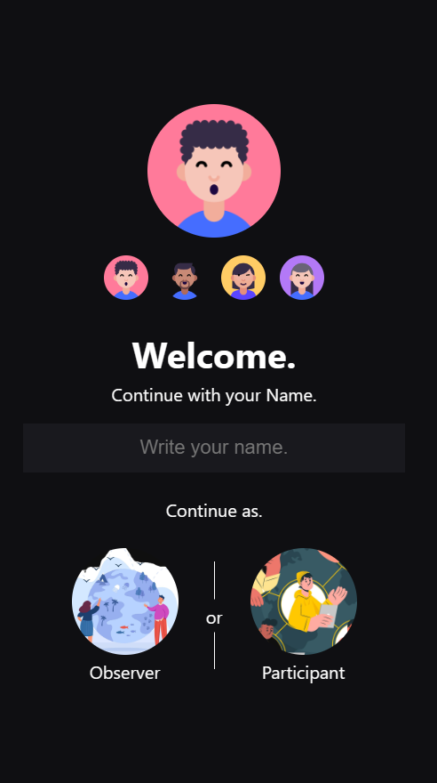
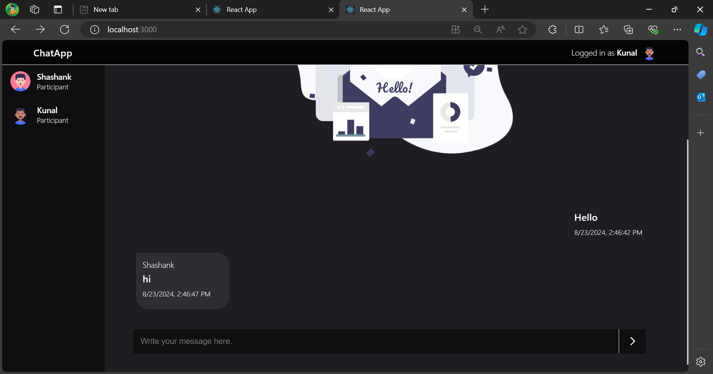

# Realtime Chat Application using gRPC
A simple drop in drop out chat application to implement important concepts of a gRPC service using ASP.NET core and ReactJS.

## Tech Used

- C#
- Javascript
- ReactJS
- Envoy Proxy
- Docker

## Node Modules

- grpc-web

## Screenshots
</img>
</img>
